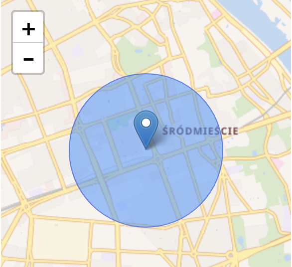

# Cell Location API Integration

This project provides a service to determine the location (latitude and longitude) based on mobile cell tower information (MCC, MNC, LAC, CellID) using various APIs, such as:

- [OpenCellID](https://www.opencellid.org)
- [UnwiredLabs](https://unwiredlabs.com)
- [Google Maps Geolocation API](https://developers.google.com/maps/documentation/geolocation/overview)

It can uses **triangulation** and **enclosing circle algorithms** to estimate the possible position of a device based on data from multiple cell towers.

## Table of Contents

- [Installation](#installation)
- [Configuration](#configuration)
- [Usage](#usage)
- [Running Tests](#running-tests)
- [Future Improvements](#future-improvements)
- [Contributing](#contributing)
- [License](#license)

---

## Installation

### Prerequisites
- PHP 8.0 or higher
- Composer (dependency management)
- An API key from OpenCellID, UnwiredLabs, and/or Google Maps Geolocation API

### Clone the repository

```bash
git clone https://github.com/LounisBou/CellLocation.git
cd CellLocation
```

### Install dependencies

```bash
composer install
```

## Configuration

Before using the project, you need to configure environment variables for API keys. You can do this by creating a `.env` file in the project root.

### Example `.env` file

```env
OPENCELLID_API_KEY=your-opencellid-api-key
UNWIREDLABS_API_KEY=your-unwiredlabs-api-key
GOOGLE_API_KEY=your-google-maps-api-key
```

### Loading Environment Variables

The project uses the **Symfony Dotenv** component to load environment variables. These environment variables are automatically loaded via the `Pest.php` file during tests or when running the project.

### Regenerating Autoloader

Ensure your classes are autoloaded by Composer. If you add or modify any classes, make sure to run:

```bash
composer dump-autoload
```

## Usage

This project allows you to fetch the location from different services by simply providing cell tower information like MCC, MNC, LAC, and CellID.

### Example Usage

#### Key Concepts

- **Cell Data**:
    - `CellData` stores the information of the device's interaction with the cell towers such as **MNC**, **MCC**, **LAC**, and **CellID**.

- **Cell Location**:
    - `CellLocation` objects store the physical location of the **cell antenna**, defined by **latitude**, **longitude**, and **accuracy** (distance range where the device might be relative to the tower).

- **Triangulation**:
    - Using data from multiple towers, the program estimates a device's position by calculating the intersection of circles defined by the cell tower locations and accuracy.
    - **Each circle** is centered at a **CellLocation**'s latitude and longitude, with a radius equal to the accuracy (distance to the device).

- **Intersection of Circles**:
    - The algorithm finds the intersection zone of the circles, calculates the **centroid** of the intersection, and uses the maximum distance between the centroid and the edges of the intersection zone to define the result possible position as a circle.

- **Smallest Enclosing Circle**:
    - The algorithm determines the smallest enclosing circle that intersects parts of all input circles. This circle's **center** represents the estimated device location, and the **radius** defines the zone of possible locations.

- **Enclosing Circle Algorithm**:
    - This algorithm calculates the smallest circle that encloses the intersection zone of all cell coverage areas.
    - `Center` geometric center of the intersection zone. 
    - `Radius` distance from the center to the farthest point within the intersection zone.


#### Get CellLocation from CellData

```php
<?php

use Lounisbou\CellLocation\CellLocator;
use Lounisbou\CellLocation\OpenCellIDService;
use Lounisbou\CellLocation\Enums\RadioType;

require_once __DIR__ . '/vendor/autoload.php';

// Instantiate the service using OpenCellID
$openCellIdService = new OpenCellIDService($_ENV['OPENCELLID_API_KEY']);

// Create the locator
$cellLocator = new CellLocator($openCellIdService);

// Create CellData object
$cellData = new CellData(
    mcc: 260,
    mnc: 2,
    lac: 10250,
    cellId: 26511,
    radioType: RadioType::GSM
);

// Find the location based on cell tower info
$location = $cellLocator->findLocation($cellData);

if ($location) {
    echo "Latitude: {$location['lat']}, Longitude: {$location['lng']}" . PHP_EOL;
} else {
    echo "Location not found." . PHP_EOL;
}
```

<p align="center">
  
</p>

#### Get triangulated CellLocation from multiple CellData

```php
<?php

use Lounisbou\CellLocation\CellLocator;
use Lounisbou\CellLocation\OpenCellIDService;
use Lounisbou\CellLocation\Enums\RadioType;

require_once __DIR__ . '/vendor/autoload.php';

// Instantiate the service using OpenCellID
$openCellIdService = new OpenCellIDService($_ENV['OPENCELLID_API_KEY']);

// Create the locator
$cellLocator = new CellLocator($openCellIdService);

// Create CellData objects
$cellData1 = new CellData(
    mcc: 260,
    mnc: 2,
    lac: 10250,
    cellId: 26511,
    radioType: RadioType::GSM
);
$cellData2 = new CellData(
    mcc: 260,
    mnc: 2,
    lac: 10250,
    cellId: 26512,
    radioType: RadioType::GSM
);
$cellData3 = new CellData(
    mcc: 260,
    mnc: 2,
    lac: 10250,
    cellId: 26513,
    radioType: RadioType::GSM
);

// Find the location based on cell tower info
$location = $cellLocator->getTriangulatedLocation([$cellData1, $cellData2, $cellData3]);

if ($location) {
    echo "Latitude: {$location['lat']}, Longitude: {$location['lng']}" . PHP_EOL;
} else {
    echo "Location not found." . PHP_EOL;
}
```

### Advanced Features
Haversine Distance Calculation: Uses the Haversine formula to calculate distances between latitude and longitude points on Earth, which accounts for the Earth's curvature.
Error Handling: Proper handling of cases where circles do not intersect or input data is insufficient.

### Limitations
This version uses an approximate method for finding the intersection of circles. For higher precision, computational geometry algorithms can be implemented, though they may require more complex libraries.
The algorithm assumes that all circles must intersect. If they don't, the program throws an error.

### Services Supported

- **OpenCellID**: Using the `OpenCellIDService`.
- **UnwiredLabs**: Using the `UnwiredLabsService`.
- **Google Geolocation API**: Using the `GoogleGeolocationService`.

## Running Tests

This project uses **Pest** for testing.

To run the tests, including those for error handling and success responses, use the following command:

```bash
./vendor/bin/pest
```

## Future Improvements

- Exact Circle Intersection: Implementing a more precise geometric intersection algorithm could improve the accuracy.
- RSSI Integration: While this implementation doesn't use RSSI, future improvements could involve integrating signal strength to improve location estimation.
- Kalman Filters: For real-time tracking, Kalman filters or other smoothing algorithms could be implemented to refine the estimated location based on multiple readings over time.

## Contributing

If you wish to contribute to this project:

1. Fork the repository.
2. Create your feature branch (`git checkout -b feature/your-feature`).
3. Commit your changes (`git commit -m 'Add your feature'`).
4. Push to the branch (`git push origin feature/your-feature`).
5. Open a pull request.

## License

This project is licensed under the MIT License. See the [LICENSE](LICENSE) file for details.

---

### Contact

If you have any questions or run into issues, feel free to [open an issue](https://github.com/LounisBou/CellLocation/issues).

---
